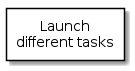

# Minitasks

Infrastructure to load small tasks and manage them 

<!-- java -jar /opt/plantuml/plantuml.jar README.md -o images -->
<!--
@startuml summary.png
top to bottom direction
skinparam packageStyle rect
rectangle "Launch\ndifferent tasks" {
}
@enduml
-->

## Requirements

*Doxygen/Latex/Graphviz/Plantuml* tools are needed to generate documentation. If you are not interested in that step, just do not execute **make doc** or **make image** optional targets.

This project is based on **C++14** standard (g++ >= 5.2, clang++ >= 3.8, apple clang++ >= 7.0), latest **boost** libraries (>=1.58), latest **ZeroMQ** (with wrappers *czmq* & *czmqpp*) and expected as well a modern *cmake* (>=3.5). Special mention to superb **Ole Christian Eidheim**'s [libraries](eidheim) based on **boost::asio** at [Simple-Web-Server](https://github.com/eidheim/Simple-Web-Server).

Hence, if you work on an updated develop environment, i.e, *Debian sid*, you are supposed to get by default the correct versions:

       rm -rf build && mkdir build && cd build && cmake ..
       
But if you're working on a more stale but robust box, i.e. *RedHat 7*, don't forget to launch **cmake** with enough information to get to latest compilers/libraries (provided specifically compiled boost libraries at /opt/gcc/boost):

       rm -rf build && mkdir build && cd build && \
       cmake -DBOOST_ROOT=/opt/gcc/boost -DCMAKE_CXX_COMPILER=/opt/gcc/bin/g++ ..

If you happen to compile a specific version of **boost** libraries for a *clang* compiler, but remember that they could depend on *libc++* and *libc++abi* when you deploy on a vanilla box. Hence a forced *RUN_PATH* compilation (rpath) will take place to hardcode libc++ & libc++abi path to */opt/clang/lib*:

       rm -rf build && mkdir build && cd build && \
       cmake -DBOOST_ROOT=/opt/clang/boost -DCMAKE_CXX_COMPILER=/opt/clang/bin/clang++ ..

Something similar if you work on *OSX* (provided Homebrew installed boost libraries at /usr/local/Cellar/boost/1.60.0_1 and zmq/zmqpp/czmp/czmpp ZeroMQ libraries). In this case no need to worry about *llvm/libc++*; on **Apple** platfomrs is the stardard choice (it seems that Google Android & Windows are following that path as well):

       bash -c "rm -rf build && mkdir build && cd build && \
       cmake -DBOOST_ROOT=/usr/local/Cellar/boost/1.60.0_1 \
             -DCZMQPP_ROOT=/opt/czmqpp \
             -DCMAKE_CXX_COMPILER=/usr/bin/clang++ .."

**Note:** Default flags are defined to statically link as much as possible depending on different systems in order not to require latest development compilers/libraries on deployment machines:

       set(CMAKE_CXX_FLAGS "-std=c++14 -Wall -Wno-unused-local-typedefs -static-libstdc++ -static-libgcc -g")
       set(Boost_USE_STATIC_LIBS ON CACHE BOOL "use static libraries from Boost")
       set(Boost_USE_STATIC_RUNTIME ON CACHE BOOL "use static runtime from Boost")       

**Note:** Remember you can ask for help to *make* command to know which targets there are available:

       make help

       The following are some of the valid targets for this Makefile:
       ... all (the default if no target is provided)
       ... clean
       ... depend
       ... package
       ... test
       ... package_source
       ... edit_cache
       ... rebuild_cache
       ... list_install_components
       ... install
       ... install/local
       ... install/strip
       ... minitasks
       ... basic
       ... unitTest
       ... image
       ... doc
       ... install_doc

## Test

Unit test could be executed by running **make test** or **unitTest**. See further details at [Test](test/README.md)

## Install

Binaries and libraries can be installed by running **make install**. Maybe it could be required *root* permissions depending on where they want to be installed into.

## Packaging

Basic packaging, i.e. tarred binaries & libraries, can be generated by running **make package**.

## Documentation

Documentation will be generated on your building directory by running **make doc** or generated & deployed by running **make install_doc**. See further details at [Documentation](doc/README.md)

If only documentation happens to be required, it's possible just to generete & deploy it on your desired location, i.e. a local **NGINX** server, withthe following options:

       rm -rf build && mkdir build && cd build && \
       cmake -DJUST_DOCUMENTATION=True -DPDF_FILE=/usr/share/nginx/html/example.pdf \
       -DHTML_DIR=/usr/share/nginx/html/example .. && make install_doc

