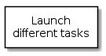

# minitasks

Infrastructure to load small tasks and manage them 

<!-- java -jar /opt/plantuml/plantuml.jar README.md -o images -->
<!--
@startuml summary.png
top to bottom direction
skinparam packageStyle rect
rectangle "Launch\ndifferent tasks" {
}
@enduml
-->

## Requirements

This project is based on **C++14** standard (g++ >= 5.2, clang++ >= 3.8), latest **boost** libraries (>=1.58) and expected as well a modern *cmake* (>=3.5) so if you work on an updated develop environment, i.e, *Debian sid*, you are supposed to get by default the correct versions:

       rm -rf build && mkdir build && cd build && cmake ..
       
But if you're working on a more stale but robust box, i.e. *RedHat 7*, don't forget to launch **cmake** with enough information to get to latest compilers/libraries (probably previously complied by you anyway):

       rm -rf build && mkdir build && cd build && cmake -DBOOST_ROOT=/opt/gcc/boost -DRPATH_LIB64=/opt/gcc/lib64 -DCMAKE_C_COMPILER=/opt/gcc/bin/gcc -DCMAKE_CXX_COMPILER=/opt/gcc/bin/g++ ..
       
       
